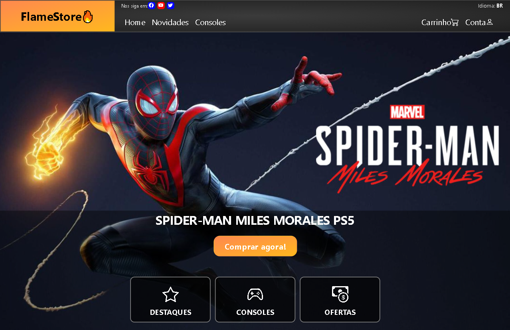
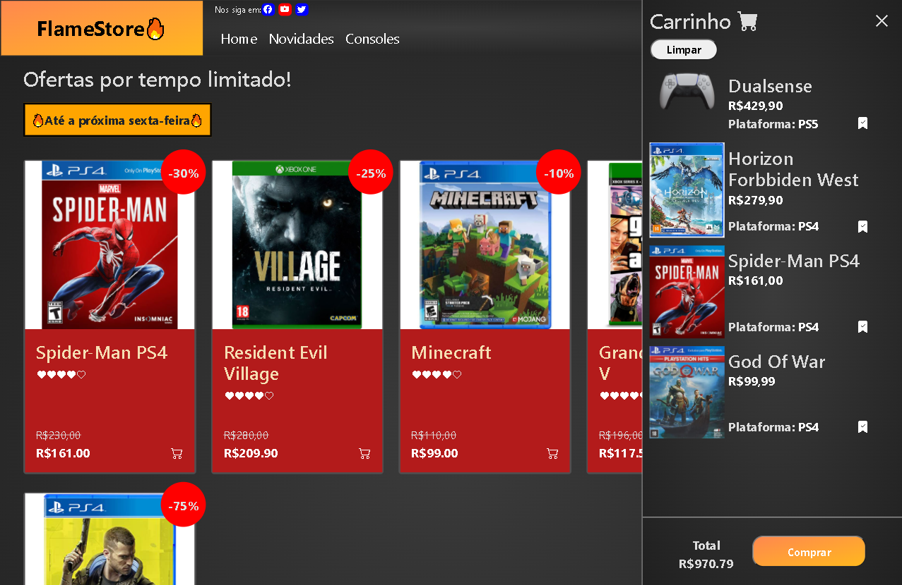
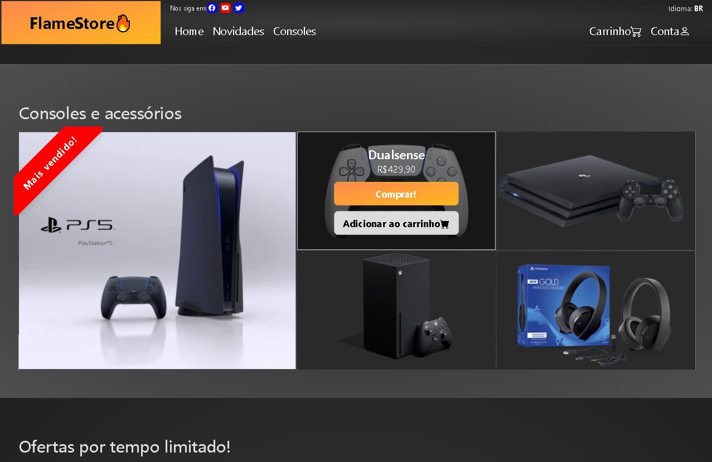
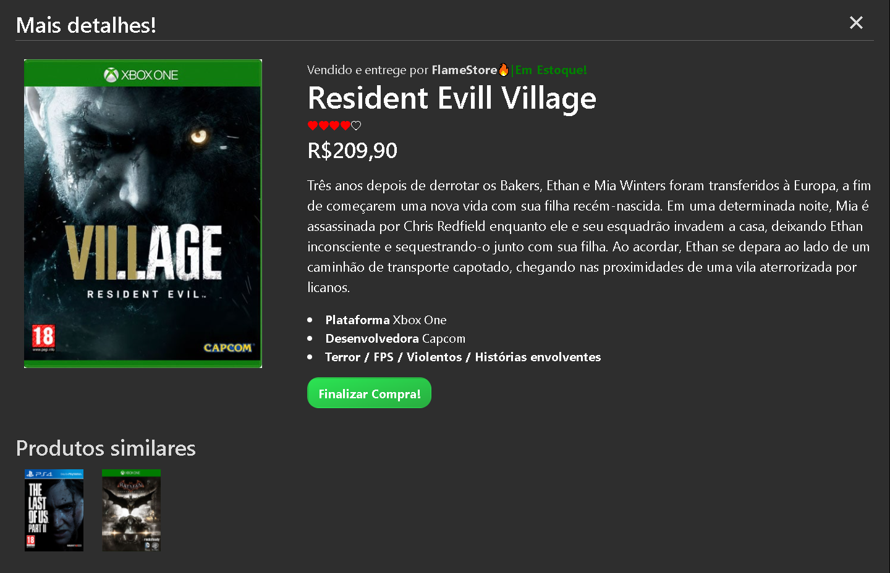

<h1 align="center">
    
</h1>
<h1 align="center">
    
</h1>
<h1 align="center">
    
</h1>
<h1 align="center">
    
</h1>

# Gamestore

<a align="center" style="font-weight: bold" href="https://alcantara-diego.github.io/gamestore/" target="_Blank">👉Acesse meu projeto nesse link👈</a>

  

<h3>Tecnologias usadas no projeto</h3>
<ul>
<li>HTML5</li>
<li>CSS3</li>
<li>Javascript</li>
<li>React.js</li>
<li>Redux</li>
<li>Bootstrap</li>
<li>Sass</li>
</ul>

  
# Descrição

Front-end de uma loja de games digital chamada <strong>FlameStore🔥</strong>, já desenvolvi muitos projetos focados em "aplicativos", e dessa vez quis criar o website de uma loja fictícia que fosse <strong>visualmente atrativa, dando ênfase a marca e logo</strong>, destacando bem os produtos oferecidos, uma aba separada usando o <strong>react-router-dom</strong> para dar mais detalhes sobre os itens desejados e um <strong>carrinho funcional</strong> para o usuário ter conhecimento do total pago em cada jogo e console.
Foi meu primeiro projeto usando <strong>Redux</strong>, e facilitou muito a organização do código por muitas funções não se misturarem mais no mesmo arquivo dos componentes e terem uma área específica para elas. 

# Aprendizados com o projeto:

<strong>Redux: </strong> Aprendi a usar o redux junto do <strong>React</strong> com <strong>React-redux</strong>, minha primeira vez usando a ferramenta que me proporcionou escrever um código mais limpo separando grandes funções do arquivo dos componentes.

<strong>Actions, reducers e combineReducers: </strong> Ainda sobre Redux, pude aprender a usar esses 3 itens para separar e organizar melhor o código.

<strong>GSAP: </strong> Neste projeto usei o GSAP pela primeira vez, uma biblioteca que auxília e ajuda na criação de <strong>animações</strong> através do <strong>Javascript</strong> com poucas linhas de código.
Usei a ferramenta para <strong>controlar a mensagem de loading na tela</strong>, que usei para compensar os segundos que a foto da tela principal leva para carregar.
E ao finalizar o loading, são animados os itens da tela principal para <strong>trazer mais vida ao projeto</strong>.

<strong>React-router-dom: </strong>Nesse projeto aprendi a usar a ferramenta que abriu a possibilidade de criar uma rota para a aba de mais informações dos produtos, sem a necessidade de usar um back-end.

<strong>Grid:</strong> Usei o grid do CSS pela primeira vez em um projeto real para criar a sessão de consoles, a ideia era dar <strong>mais destaque</strong> a um dos consoles apresentados, e quis fazer isso o tornando maior que os outros itens por meio da grid, achei mais fácil para controlar a responsividade em telas pequenas do que usando o <strong>flexbox </strong>naquele caso específico.
  

# Features do projeto:
 
<strong>Adicionar produtos ao carrinho:</strong> todo item tem a opção de ser adicionado no carrinho, somando os preços a apresentando o valor total dos produtos para o usuário.

<strong>Limpar carrinho: </strong> Botão para apagar todos itens salvos, optei pela função de remover todos de uma vez invés de cada um ter seu botão específico, pois já tenho outros projetos focados em controlar uma lista, e o <strong>foco da Gamestore</strong> era <strong>apresentar meus conhecimentos criando uma loja</strong> oferecendo produtos de fato, então nesse caso optei por uma <strong>solução simplificada</strong>.

<strong>Aba de mais detalhes: </strong>Cada produto tem sua própria descrição, plataforma de uso, nome da desenvolvedora e tags associadas a ele ao clicar na opção de comprar o produto, as informações são exibidar numa aba separada controlada pelo <strong>React-router-dom</strong>.

<strong>Botões de autoscroll: </strong>Para facilitar a procura de uma sessão específica, tanto na navbar quanto na hero section é apresentado botões que te direcionam automaticamente para a sessão desejada.

# Botões apenas visuais:

<strong>Opção de conta na navbar, botão de compra no carrinho e opção de finalizar compra na aba de detalhes: </strong> Foram inseridos apenas pela simulação de uma loja verdadeira e e não exercem nenhuma função além de decoração visual.

   
 # Pré-requisitos:

 Nenhum pré-requisito necessário, apenas te convido a dar uma olhada :)

 
<a align="center" style="font-weight: bold" href="https://alcantara-diego.github.io/gamestore/" target="_Blank">👉Acesse meu projeto nesse link👈</a>

  

<strong>|Made with ❤️ by Diego Alcântara 👨🏽‍💻 <a align="center" style="font-weight: bold" href="https://www.linkedin.com/in/diego-alc%C3%A2ntara-790424235" target="_Blank">See my linkedIn</a></strong>
